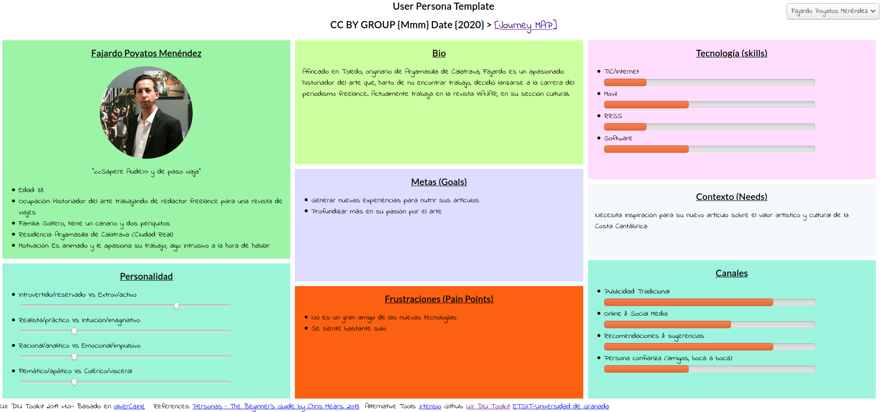
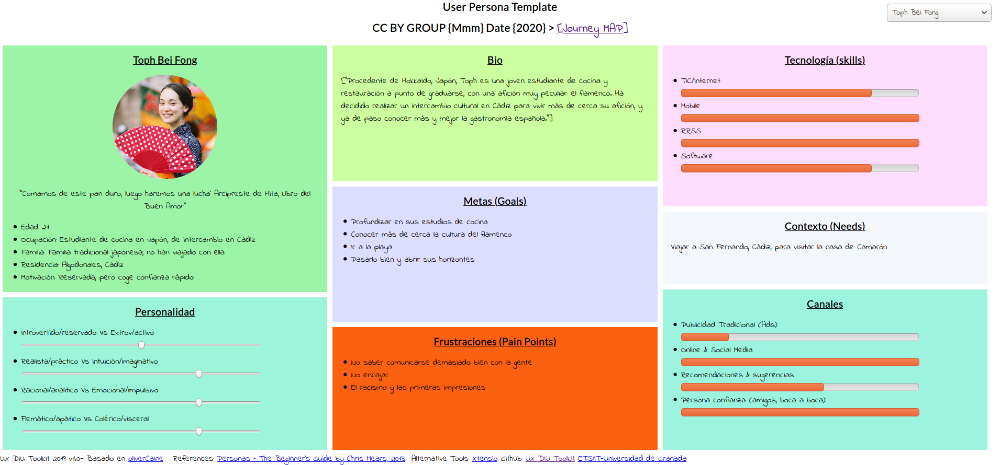

# Práctica 1: Análisis de la Interfaz de Usuario. Revisión de Usabilidad.

Prácticas Diseño Interfaces de Usuario 2019-20 (Economía Colaborativa)

Grupo: DIU1_01Mmm. Curso: 2019/20

Proyecto: DIU1.Mmm

Descripción: Mmm.

Miembros: **Ana María Romero Delgado** y **Juan Ocaña Valenzuela**.

Repositorio: https://github.com/patchispatch/DIU20

## Desk research: Análisis Competencia 

Las aplicaciones asignadas son de viajes basados en economía colaborativa. La finalidad de estos viajes puede ser únicamente de transporte como de experiencias.

Hemos elegido Nomadizers por el concepto que tiene de las experiencias y porque consideramos que puede mejorar su experiencia de usuario.

## 2 Personas 

Son dos personas con perfiles que encajan como usuarios de la página, con contextos, edades diversas y necesidades distintas.

## 2 User Journey Map  (1 por persona)

Es común que gente reacia a la tecnología tenga problemas sin una buena experiencia de usuario. Aun así, una buena experiencia de usuario es útil.

## Revisión de Usabilidad 

La revisión de usabilidad se encuentra en P1/usability review.xlsx

Valoración numérica: 49 puntos.

La aplicación deja mucho que desear, a cada función que probábamos encontrábamos errores. Además es poco visual y está llena de publicidad.