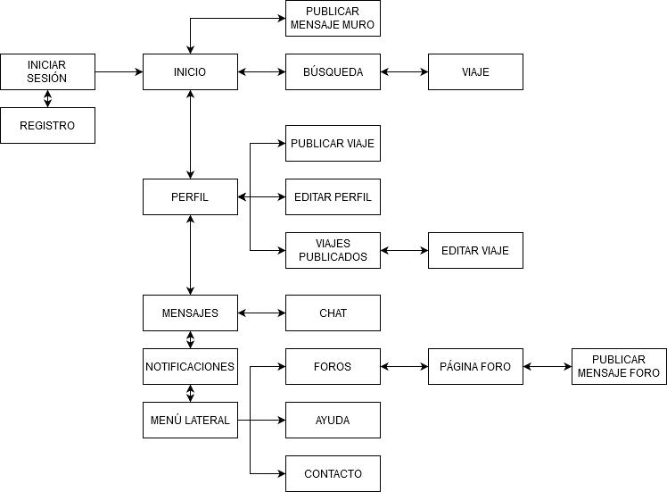
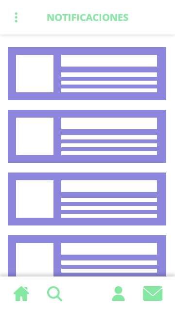
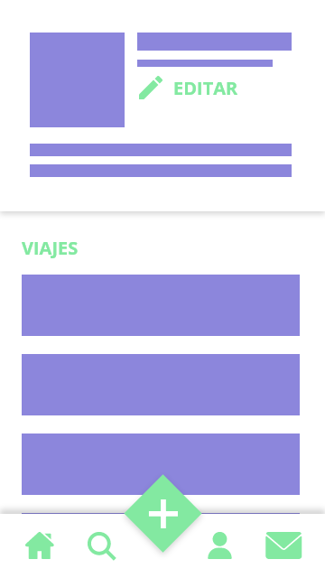
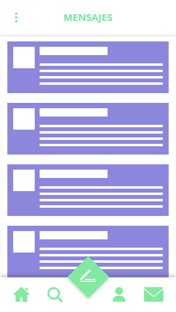
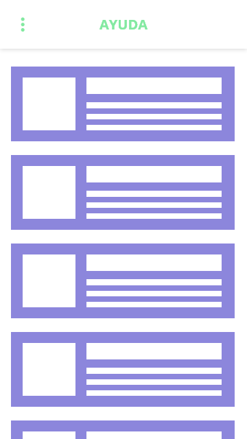
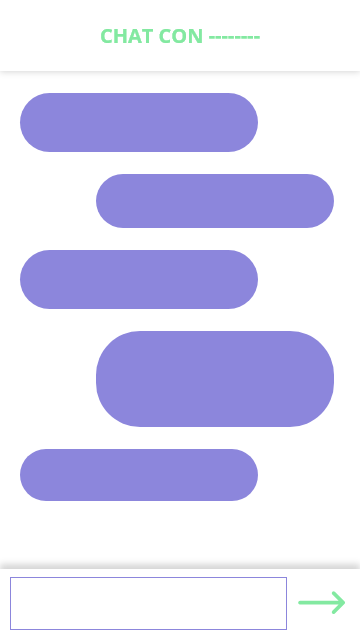
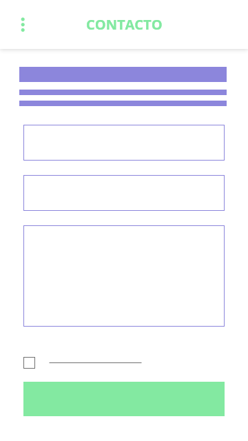

# Práctica 2: Diseño de Bocetos. Propuesta de App de Economía Colaborativa.

Prácticas Diseño Interfaces de Usuario 2019-20 (Economía Colaborativa)

Grupo: DIU1_01Mmm. Curso: 2019/20

Proyecto: DIU1.Mmm

Descripción: Mmm.

Miembros: **Ana María Romero Delgado** y **Juan Ocaña Valenzuela**.

Repositorio: https://github.com/patchispatch/DIU20

## Malla receptora de información.

Esta es la información que hemos recopilado a partir de la práctica 1 y de un análisis de la página web *Nomadizers*. 

Como puntos fuertes de la página vimos que hace *énfasis en la experiencia de viaje*, priorizando el juntar a gente con mismos gustos a gente con el mismo destino. También tiene un buen *aspecto comunitario y de red social* gracias a los foros, donde los viajeros comparten experiencias, dudas y recomendaciones.  Además la parte de creación de viajes cuenta con *formularios* bastante sencillos e intuitivos, lo cual facilita la experiencia de usuario al usar la página.

Como puntos débiles de la página vimos que hace falta un *buen contraste de elementos* y que *es muy poco accesible e intuitiva*, la *publicidad es muy invasiva* (cubre la mayor parte de la visión que tiene el usuario de la página), tiene una *estructura bastante caótica* y es muy complicado *comunicarse* a través de ella.

Los usuarios tienen varias preguntas sobre la página, referentes a *búsqueda más sencilla*, *filtros en la búsqueda* y *comunicación* dentro de la página.

Como nuevas ideas a partir de ella, proponemos *simplificar en secciones* las tareas que puedes hacer en la página (viajes, personas y publicación), introducir el concepto de *usuario verificado* para poner en mejor lugar a las agencias de viajes, un *chat integrado* para mejorar la comunicación y mejorar más aún el *aspecto social* de la web con foros y mensajes.

## Matriz de tareas/usuarios

Hemos decidido crear cuatro tipos de usuarios distintos que pueden usar la aplicación:

+ El **usuario no identificado** es una persona que está teniendo un primer contacto con la aplicación, que no desea registrarse pero sí buscar información sobre viajes, que desea probar la experiencia o simplemente un usuario que necesita identificarse. Puede hacer tareas como *registrarse*, *ver perfiles de usuarios* y *buscar y ver viajes*.
+ El **usuario identificado** es una persona que suele usar la aplicación, y puede hacer las mismas tareas que un *usuario no identificado* pero no puede volver a registrarse. Además, puede *inscribirse, publicar, modificar y cancelar un viaje propio*, *modificar su perfil*, *utilizar el servicio de mensajería* y *participar en foros*.
+ El **usuario verificado** es una persona o empresa que suele usar recurrentemente la aplicación para distribuir sus servicios de viajes. Obtiene algunos privilegios respecto al usuario identificado tales como *promocionar y ver las estadísticas de sus propios viajes*.
+ El **administrador** es una persona con privilegios sobre el contenido de la aplicación. Sus tareas son *eliminar usuarios y mensajes* que no cumplan con las reglas de la aplicación, *moderar en foros* y *cancelar viajes*.

|                                    | Usuario no identificado | Usuario identificado | Usuario verificado | Administrador |
| ---------------------------------- | :---------------------: | :------------------: | :----------------: | :-----------: |
| Registrarse                        |            M            |                      |                    |               |
| Identificarse                      |                         |          A           |         A          |       A       |
| Borrar usuario                     |                         |                      |                    |       B       |
| Buscar viaje                       |            M            |          A           |         A          |       A       |
| Ver viaje                          |            M            |          A           |         A          |       A       |
| Inscribirse a viaje                |                         |          M           |         M          |               |
| Publicar viaje                     |                         |          M           |         M          |               |
| Modificar viaje propio             |                         |          B           |         B          |               |
| Cancelar viaje propio              |                         |          B           |         B          |               |
| Cancelar viaje ajeno               |                         |                      |                    |       B       |
| Promocionar viajes propios         |                         |                      |         A          |               |
| Ver estadísticas de viajes propios |                         |                      |         A          |               |
| Ver perfil                         |            M            |          M           |         M          |       A       |
| Modificar perfil propio            |                         |          B           |         B          |               |
| Utilizar mensajería                |                         |          A           |         A          |               |
| Publicar mensaje                   |                         |          A           |         A          |               |
| Eliminar mensaje propio            |                         |          B           |         B          |               |
| Eliminar mensajes ajeno            |                         |                      |                    |       B       |
| Participar en foros                |                         |          A           |         A          |               |
| Moderar foros                      |                         |                      |                    |       M       |

## Mapa (sitemap)

Esta es la estructura jerárquica que tiene nuestra aplicación. Después de pasar el proceso de *registro/inicio de sesión* se puede acceder a la página de *inicio*, desde la cual podemos *publicar mensajes*, *buscar viajes*, *ver nuestro perfil y acceder a la información de nuestros viajes*, acceder a la *mensajería* y ver el *menú lateral*.

## Etiquetado (Labelling)

Este es el significado de cada sitio representado anteriormente. Cada página representa una de las funciones que un usuario estándar puede realizar.

| Término                                      | Significado                                                  |
| -------------------------------------------- | ------------------------------------------------------------ |
| Inicio                                       | Página inicial y central de la aplicación; muestra el *muro* |
| Iniciar sesión                               | Introducir datos de usuario para entrar en la aplicación     |
| Registro                                     | Formulario para el ingreso de un nuevo usuario               |
| Muro                                         | Conjunto de mensajes que escriben los usuarios               |
| Publicar mensaje                             | Formulario para escribir un nuevo mensaje en el muro         |
| Búsqueda                                     | Búsqueda del contenido de la aplicación (viajes y perfiles)  |
| Resultados                                   | Resultados de la búsqueda de contenido (viajes y perfiles)   |
| Foros                                        | Conjunto de mensajes sobre temas de interés                  |
| Página del foro                              | Mensajes, dudas y opiniones de los usuarios sobre el tema de interés |
| Publicar mensaje en el foro                  | Formulario para escribir un nuevo mensaje en el foro         |
| Perfil                                       | Información de un usuario                                    |
| Editar perfil                                | Edición de la información de un usuario                      |
| Mensajes                                     | Conjunto de conversaciones en las que participa un usuario   |
| Chat                                         | Conversación en la que participa un usuario                  |
| Notificaciones del muro y de foros           | Avisos sobre nuevos mensajes                                 |
| Viaje                                        | Página descriptiva de un viaje publicado                     |
|        | Icono relacionado con la página *Inicio*                     |
|      | Icono relacionado con la página *Búsqueda* y la acción de buscar resultados |
|        | Icono relacionado con la página *Perfil*                     |
|        | Icono relacionado con la página *Mensajes*                   |
|        | Icono relacionado con la publicación de mensajes, tanto en el *muro* como en el *foro* |
|        | Icono relacionado con la publicación de un nuevo *viaje*     |
|        | Icono relacionado con la *edición* de una página, ya sea el *perfil* o un *viaje* |
|  | Icono relacionado con la inscripción a un *viaje*            |
|       | Icono relacionado con el *envío* de un mensaje               |

## Bocetos Lo-Fi

Estas son las distintas pantallas de la interfaz de la aplicación.

| Inicio                          | Búsqueda                       | Notificaciones                  |
| ------------------------------- | ------------------------------ | ------------------------------- |
|            |       |  |
| **Perfil**                      | **Mensajes**                   | **Viaje**                       |
|          |       |           |
| **Foros**                       | **Página foro**                | **Publicar mensaje foro**       |
|           |    |   |
| **Publicar mensaje muro**       | **Editar perfil**              | **Editar viaje:**               |
|        |  |    |
| **Ayuda**                       | **Chat**                       | **Contacto**                    |
|           |           |        |
| **Iniciar sesión**              | **Registro**                   | **Menú lateral**                |
|  |       |    |

