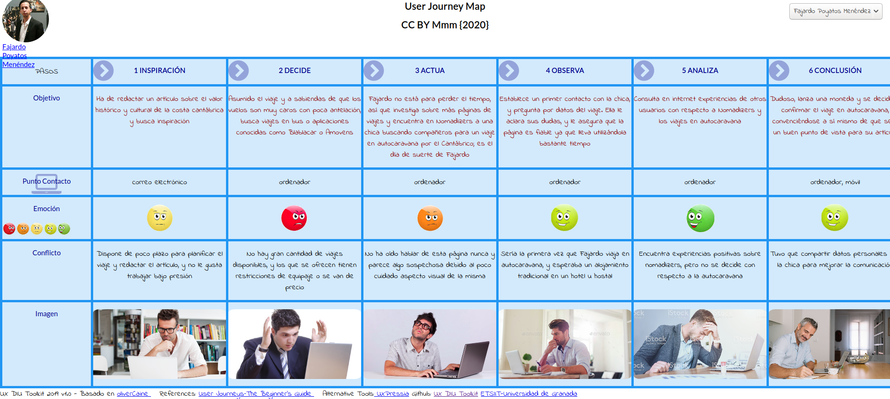
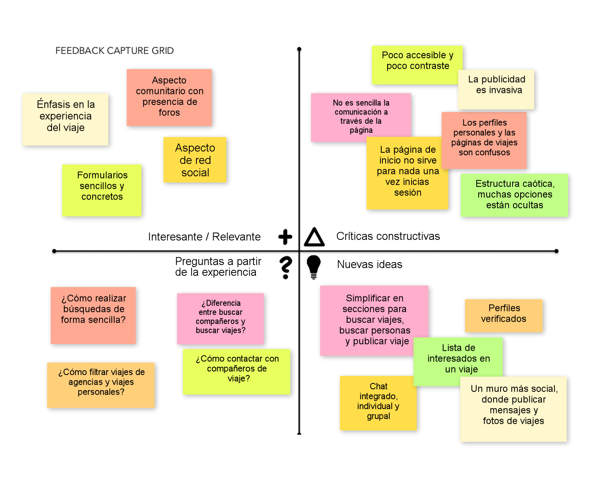
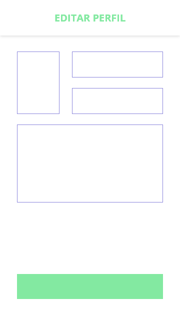
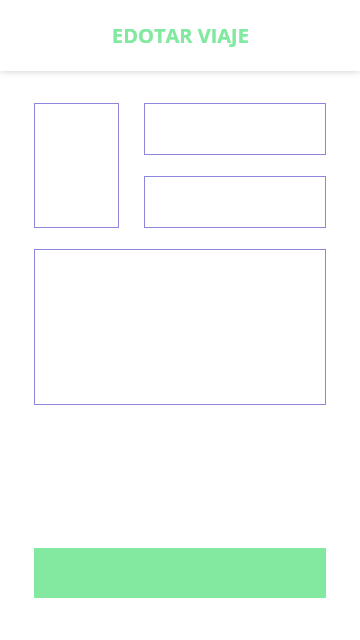

# Práctica 3: UX-Case Study

## Análisis de nuestra aplicación

### Introducción

¿Deseas tener nuevas experiencias de viaje y conocer gente nueva afín con tus gustos? ¿Quieres dirigirte a un sitio en concreto y buscas opiniones sobre otras personas? ¿Te gustaría organizar un tour por una ciudad para disfrutar de una actividad en concreto pero no te gustaría hacerlo solo?

Hemos creado esta aplicación con el fin de dar una opción rápida y sencilla para satisfacer estas preguntas sobre viajes y experiencias.

### Estudio de mercado

Recopilamos una serie de necesidades básicas que pueden tener nuestros usuarios objetivo, tales como:

+ Los usuarios buscan viajes con el fin de pasar su tiempo libre, por trabajo o por necesidad.
+ Los usuarios comparten sus experiencias y opiniones sobre destinos, alojamientos, y más información útil para otros usuarios.
+ Los usuarios crean viajes y tours sobre una actividad en concreto para disfrutarlos con otras personas.

### Análisis competitivo

Decidimos probar distintas páginas de viajes para ver cómo representaban los viajes y cómo de importante era la componente social. Al final elegimos centrarnos en la web Nomadizers por lo original que es su concepto de "experiencia de viaje" (el destino no es lo importante, es la experiencia con la gente que te acompaña).

Al usar la página web observamos que:

+ Toda la página y en especial el formulario de creación de viajes no son sencillos, rápidos e intuitivos.
+ Tiene mucho aspecto comunitario.
+ Las recomendaciones personalizadas están poco visibles entre anuncios de otros sitios web.
+ No hay guía de ayuda ni tutorial.
+ El lenguaje y la terminología son adecuados.
+ No se puede compartir contenido por redes sociales.
+ Se hace énfasis en compartir experiencias con otras personas, no en el viajar a un destino.
+ Se usan foros, pero no están bien organizados.

### Personas

Creamos dos personas para identificar las metas y los puntos de dolor de nuestros usuarios objetivo. Ambos tienen perfiles que encajan como usuarios de la página, con contextos, edades y necesidades distintas.

Nuestra primera persona, **Fajardo Poyatos Menéndez**, es un periodista freelance reacio a la tecnología y apasionado del arte:

Y nuestra segunda persona, **Toph Bei Fong**, es una estudiante de cocina un poco tímida que adora el flamenco:

### Objetivos de los usuarios

Identificamos los objetivos de los usuarios basándonos en las dos personas que hemos creado:

+ Los usuarios quieren una aplicación fácil y rápida de usar, que además sea intuitiva, para no perder el tiempo ni frustrarse al realizar la tarea que quieren llevar a cabo.
+ Los usuarios quieren interaccionar con otros usuarios de la aplicación para poder realizar viajes juntos.
+ Los usuarios quieren ver y escribir reseñas, experiencias y opiniones de sus viajes.

### Puntos de dolor de los usuarios

También identificamos los puntos de dolor de los usuarios, basándonos también en las dos personas que hemos creado:

+ Los usuarios no quieren distraerse de su tarea principal.
+ La comunicación con los interesados en un viaje debe ser simple y eficaz.
+ Algunos usuarios necesitan ayuda adicional para usar la página.

### User Journey Maps

Fajardo quiere buscar un viaje barato al norte de España para poder inspirarse y redactar su artículo relacionado con la Costa Cantábrica:

Toph quiere conocer más sobre la historia de Camarón, y busca una ruta por San Fernando:

### Malla receptora de información

Como conclusión al uso de la página Nomadizers, creamos este diagrama con los aspectos más destacados. 

Partiendo de la página web, proponemos *simplificar en secciones* las tareas que puedes hacer en la página (viajes, personas y publicación), introducir el concepto de *usuario verificado* para poner en mejor lugar a las agencias de viajes, un *chat integrado* para mejorar la comunicación y mejorar más aún el *aspecto social* de la web con foros y mensajes.

### Matriz de Tareas y Usuarios

Necesitábamos distinguir entre usuarios cuya actividad principal es buscar viajes y usuarios que suelen publicar viajes (como las agencias), por lo que las tareas que se pueden realizar en la aplicación y los usuarios que pueden realizarlas son:

|                                    | Usuario no identificado | Usuario identificado | Usuario verificado | Administrador |
| ---------------------------------- | :---------------------: | :------------------: | :----------------: | :-----------: |
| Registrarse                        |            M            |                      |                    |               |
| Identificarse                      |                         |          A           |         A          |       A       |
| Borrar usuario                     |                         |                      |                    |       B       |
| Buscar viaje                       |            M            |          A           |         A          |       A       |
| Ver viaje                          |            M            |          A           |         A          |       A       |
| Inscribirse a viaje                |                         |          M           |         M          |               |
| Publicar viaje                     |                         |          M           |         M          |               |
| Modificar viaje propio             |                         |          B           |         B          |               |
| Cancelar viaje propio              |                         |          B           |         B          |               |
| Cancelar viaje ajeno               |                         |                      |                    |       B       |
| Promocionar viajes propios         |                         |                      |         A          |               |
| Ver estadísticas de viajes propios |                         |                      |         A          |               |
| Ver perfil                         |            M            |          M           |         M          |       A       |
| Modificar perfil propio            |                         |          B           |         B          |               |
| Utilizar mensajería                |                         |          A           |         A          |               |
| Publicar mensaje                   |                         |          A           |         A          |               |
| Eliminar mensaje propio            |                         |          B           |         B          |               |
| Eliminar mensajes ajeno            |                         |                      |                    |       B       |
| Participar en foros                |                         |          A           |         A          |               |
| Moderar foros                      |                         |                      |                    |       M       |

Por tanto, tenemos cuatro tipos de usuario en la aplicación:

+ Un **usuario sin identificar** que entra a la aplicación para ver viajes.
+ Un **usuario identificado** que suele buscar viajes, publica alguno de vez en cuando y participa en foros.
+ Un **usuario verificado** que se dedica a publicar viajes y promocionarlos.
+ El **administrador** de la aplicación, encargado de moderar la aplicación.

### Mapa del sitio y etiquetado

Con todas estas posibles acciones que puede hacer el usuario, diseñamos el concepto de la aplicación y sus páginas:

| Término                                      | Significado                                                  |
| -------------------------------------------- | ------------------------------------------------------------ |
| Inicio                                       | Página inicial y central de la aplicación; muestra el *muro* |
| Iniciar sesión                               | Introducir datos de usuario para entrar en la aplicación     |
| Registro                                     | Formulario para el ingreso de un nuevo usuario               |
| Muro                                         | Conjunto de mensajes que escriben los usuarios               |
| Publicar mensaje                             | Formulario para escribir un nuevo mensaje en el muro         |
| Búsqueda                                     | Búsqueda del contenido de la aplicación (viajes y perfiles)  |
| Resultados                                   | Resultados de la búsqueda de contenido (viajes y perfiles)   |
| Foros                                        | Conjunto de mensajes sobre temas de interés                  |
| Página del foro                              | Mensajes, dudas y opiniones de los usuarios sobre el tema de interés |
| Publicar mensaje en el foro                  | Formulario para escribir un nuevo mensaje en el foro         |
| Perfil                                       | Información de un usuario                                    |
| Editar perfil                                | Edición de la información de un usuario                      |
| Mensajes                                     | Conjunto de conversaciones en las que participa un usuario   |
| Chat                                         | Conversación en la que participa un usuario                  |
| Notificaciones del muro y de foros           | Avisos sobre nuevos mensajes                                 |
| Viaje                                        | Página descriptiva de un viaje publicado                     |
|        | Icono relacionado con la página *Inicio*                     |
|      | Icono relacionado con la página *Búsqueda* y la acción de buscar resultados |
|        | Icono relacionado con la página *Perfil*                     |
|        | Icono relacionado con la página *Mensajes*                   |
|        | Icono relacionado con la publicación de mensajes, tanto en el *muro* como en el *foro* |
|        | Icono relacionado con la publicación de un nuevo *viaje*     |
|        | Icono relacionado con la *edición* de una página, ya sea el *perfil* o un *viaje* |
|  | Icono relacionado con la inscripción a un *viaje*            |
|       | Icono relacionado con el *envío* de un mensaje               |

### Primer prototipo

Diseñamos los primeros bocetos Lo-Fi de lo que serían las distintas pantallas de la aplicación:

| Inicio                                | Búsqueda                             | Notificaciones                        |
| ------------------------------------- | ------------------------------------ | ------------------------------------- |
|            |       |  |
| **Perfil**                            | **Mensajes**                         | **Viaje**                             |
|          |       |           |
| **Foros**                             | **Página foro**                      | **Publicar mensaje foro**             |
|           |    |   |
| **Publicar mensaje muro**             | **Editar perfil**                    | **Editar viaje:**                     |
|        |  |    |
| **Ayuda**                             | **Chat**                             | **Contacto**                          |
|           |           |        |
| **Iniciar sesión**                    | **Registro**                         | **Menú lateral**                      |
|  |       |    |

### Logotipo

Para actualizar la imagen de la aplicación a las nuevas líneas de diseño, expuestas con más detalle en el punto **Guía de Estilo**, se ha optado por un diseño más sobrio a la vez que colorido. Esto a su vez ayuda a identificar la marca en formatos más pequeños, como las pantallas de dispositivos móviles o el icono identificativo de la app.

Podemos observar el logo antiguo aquí:

Y los logos nuevos aquí:

### Guía de estilo

La nueva imagen corporativa que proponemos para Nomadizers ha sido elaborada utilizando Adobe Illustrator CC. 

## Propuesta de elementos de diseño o patrones a usar 

## Historia en Video del UX Case Study

## Documentación. Valoración del equipo sobre la realización de esta práctica o los problemas surgidos

