Prácticas Diseño Interfaces de Usuario 2019-20 (Economía Colaborativa) 

Grupo: DIU1_01Mmm.  Curso: 2019/20 

Proyecto: DIU1.Mmm

Descripción: Mmm.

Logotipo:

Miembros
 * :bust_in_silhouette:   Ana María Romero Delgado     :octocat:     
 * :bust_in_silhouette:  Juan Ocaña Valenzuela     :octocat:

-----

En esta práctica estudiaremos un caso de plataforma de economía colaborativa y realizaremos una propuesta para su diseño Web/movil. Utilizaremos herramientas y entregables descritos en el siguiente CheckList (https://github.com/mgea/UX-DIU-Checklist) 

Qué es economia colaborativa: Martínez-Polo, J. (2019). **El fenómeno del consumo colaborativo: del intercambio de bienes y servicios a la economía de las plataformas**, *Sphera Publica, 1*(19), 24-46. http://sphera.ucam.edu/index.php/sphera-01/article/view/363/14141434

# Proceso de Diseño 

## Paso 1. UX Desk Research & Analisis 

 1.a Competitive Analysis
-----

>>> Describe brevemente características de las aplicaciones que tienes asignadas, y por qué has elegido una de ellas (150-300 caracteres) 

Las aplicaciones asignadas son de viajes basados en economía colaborativa. La finalidad de estos viajes puede ser únicamente de transporte como de experiencias. 

Hemos elegido Nomadizers por el concepto que tiene de las experiencias y porque consideramos que puede mejorar su experiencia de usuario.

 1.b Persona
-----

>>> Comenta brevemente porqué has seleccionado a esas personas y sube una captura de pantalla de su ficha  (80-150 caracteres)

Son dos personas con perfiles que encajan como usuarios de la página, con contextos, edades diversas y necesidades distintas.

 1.c User Journey Map
----

>>> Comenta brevemente porqué has escogido estas dos experiencias de usuario (y si consideras que son habituales) (80-150 caracteres) 

Es común que gente reacia a la tecnología tenga problemas sin una buena experiencia de usuario. Aun así, una buena experiencia de usuario es útil.

 1.d Usability Review
----
>>>  Revisión de usabilidad: (toma los siguientes documentos de referencia y verifica puntos de verificación de  usabilidad
>>>> Se deben incluir claramente los siguientes elementos
>>> - Ruta del documento:
>>> - Valoración final (numérica):
>>> - Comentario sobre la valoración:  (60-120 caracteres)

La revisión de usabilidad se encuentra en P1/usability review.xlsx

Valoración numérica: 49 puntos.

La aplicación deja mucho que desear, a cada función que probábamos encontrábamos errores. Además es poco visual y está llena de publicidad.

## Paso 2. UX Design  

 2.a Feedback Capture Grid
----

>>> Comenta con un diagrama los aspectos más destacados a modo de conclusion de la práctica anterior:

> > > ¿Que planteas como "propuesta de valor" para un nuevo diseño de aplicación para economía colaborativa? (150-200 caracteres)

 2.b Tasks & Sitemap 
-----

> > > Definir "User Map" y "Task Flow".

Matriz de Tareas y Usuarios:

|                                    | Usuario no identificado | Usuario identificado | Usuario verificado | Administrador |
| ---------------------------------- | :---------------------: | :------------------: | :----------------: | :-----------: |
| Registrarse                        |            M            |                      |                    |               |
| Identificarse                      |                         |          A           |         A          |       A       |
| Borrar usuario                     |                         |                      |                    |       B       |
| Buscar viaje                       |            M            |          A           |         A          |       A       |
| Ver viaje                          |            M            |          A           |         A          |       A       |
| Inscribirse a viaje                |                         |          M           |         M          |               |
| Publicar viaje                     |                         |          M           |         M          |               |
| Modificar viaje propio             |                         |          B           |         B          |               |
| Cancelar viaje propio              |                         |          B           |         B          |               |
| Cancelar viaje ajeno               |                         |                      |                    |       B       |
| Promocionar viajes propios         |                         |                      |         A          |               |
| Ver estadísticas de viajes propios |                         |                      |         A          |               |
| Ver perfil                         |            M            |          M           |         M          |       A       |
| Modificar perfil propio            |                         |          B           |         B          |               |
| Utilizar mensajería                |                         |          A           |         A          |               |
| Publicar mensaje                   |                         |          A           |         A          |               |
| Eliminar mensaje propio            |                         |          B           |         B          |               |
| Eliminar mensajes ajeno            |                         |                      |                    |       B       |
| Participar en foros                |                         |          A           |         A          |               |
| Moderar foros                      |                         |                      |                    |       M       |

Sitemap:

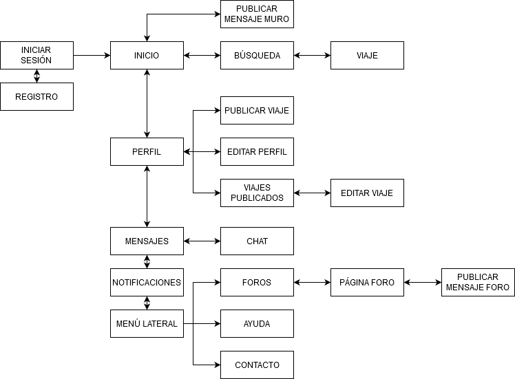

 2.c Labelling 
----

>>> Identificar términos para diálogo con usuario  

| Término                                   | Significado                                                  |
| ----------------------------------------- | ------------------------------------------------------------ |
| Inicio                                    | Página inicial y central de la aplicación; muestra el *muro* |
| Iniciar sesión                            | Introducir datos de usuario para entrar en la aplicación     |
| Registro                                  | Formulario para el ingreso de un nuevo usuario               |
| Muro                                      | Conjunto de mensajes que escriben los usuarios               |
| Publicar mensaje                          | Formulario para escribir un nuevo mensaje en el muro         |
| Búsqueda                                  | Búsqueda del contenido de la aplicación (viajes y perfiles)  |
| Resultados                                | Resultados de la búsqueda de contenido (viajes y perfiles)   |
| Foros                                     | Conjunto de mensajes sobre temas de interés                  |
| Página del foro                           | Mensajes, dudas y opiniones de los usuarios sobre el tema de interés |
| Publicar mensaje en el foro               | Formulario para escribir un nuevo mensaje en el foro         |
| Perfil                                    | Información de un usuario                                    |
| Editar perfil                             | Edición de la información de un usuario                      |
| Mensajes                                  | Conjunto de conversaciones en las que participa un usuario   |
| Chat                                      | Conversación en la que participa un usuario                  |
| Notificaciones del muro y de foros        | Avisos sobre nuevos mensajes                                 |
| Viaje                                     | Página descriptiva de un viaje publicado                     |
|        | Icono relacionado con la página *Inicio*                     |
|      | Icono relacionado con la página *Búsqueda* y la acción de buscar resultados |
|        | Icono relacionado con la página *Perfil*                     |
|        | Icono relacionado con la página *Mensajes*                   |
|        | Icono relacionado con la publicación de mensajes, tanto en el *muro* como en el *foro* |
|        | Icono relacionado con la publicación de un nuevo *viaje*     |
|        | Icono relacionado con la *edición* de una página, ya sea el *perfil* o un *viaje* |
|  | Icono relacionado con la inscripción a un *viaje*            |
|       | Icono relacionado con el *envío* de un mensaje               |

 2.d Wireframes
-----

>>> Plantear el  diseño del layout para Web/movil (organización y simulación ) 

**Inicio:**

**Búsqueda:**

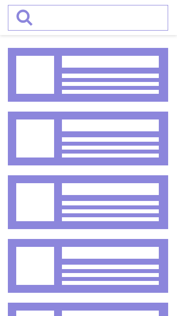

**Notificaciones:**

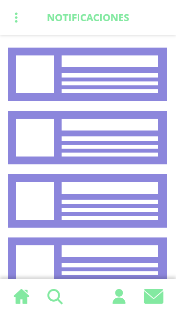

**Perfil**

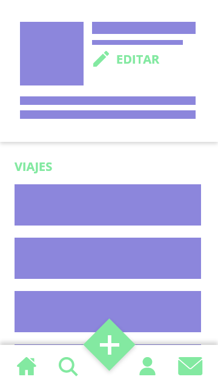

**Mensajes:**

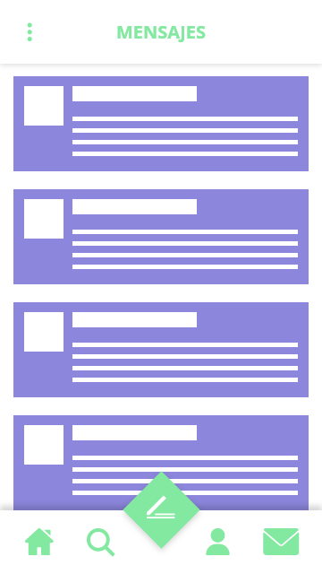

**Viaje:**

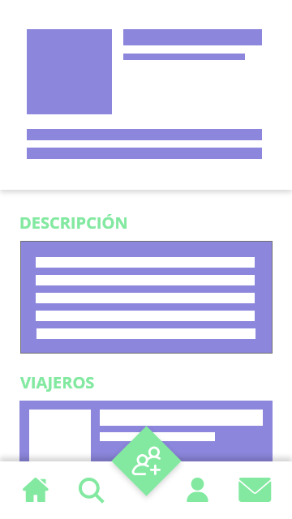

**Foros:**

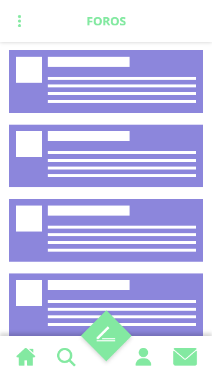

**Página foro:**

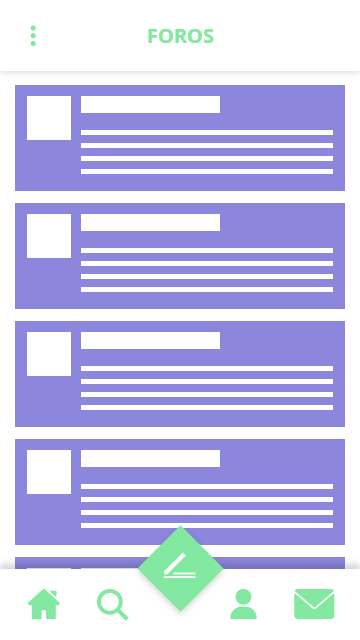

**Publicar mensaje foro:**

**Publicar mensaje muro:**

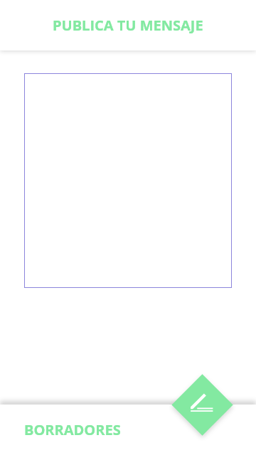

**Editar perfil:**

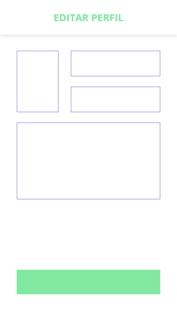

**Editar viaje:**

**Ayuda:**

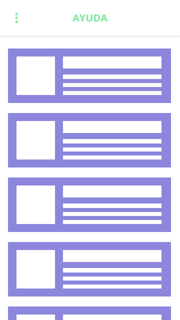

**Chat:**

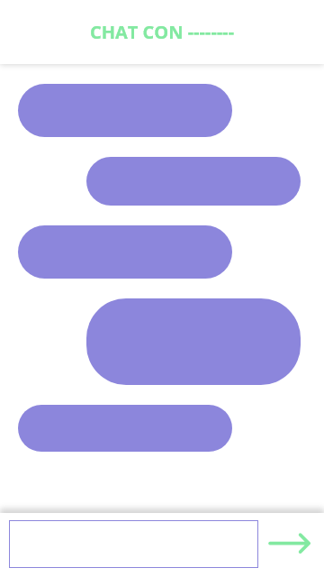

**Contacto:**

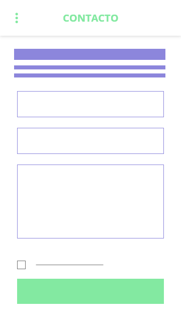

**Iniciar sesión:**

**Registro:**

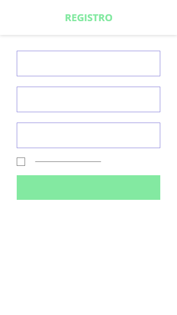

**Menú lateral**

****

****

## Paso 3. Make (Prototyping) 

 3.a Moodboard
-----

>>> Plantear Diseño visual con una guía de estilos visual (moodboard) 

  3.b Landing Page
----

>>> Plantear Landing Page 

 3.c Guidelines
----

>>> Estudio de Guidelines y Patrones IU a usar 

  3.d Mockup
----

>>> Layout: Mockup / prototipo HTML  (que permita simular tareas con estilo de IU seleccionado)

## Paso 4. UX Check (Usability Testing) 

 4.a A/B Testing
----

>>> Comprobacion de asignaciones para A/B Testing. Asignaciones https://github.com/mgea/DIU19/blob/master/ABtesting.md

>>>> Práctica A: 

 4.b User Testing
----

>>> Usuarios para evaluar prácticas 

| Usuarios | Sexo/Edad     | Ocupación   |  Exp.TIC    | Personalidad | Plataforma | TestA/B
| ------------- | -------- | ----------- | ----------- | -----------  | ---------- | ----
| User1's name  | H / 18   | Estudiante  | Media       | Introvertido | Web.       | A 
| User2's name  | H / 18   | Estudiante  | Media       | Timido       | Web        | A 
| User3's name  | M / 35   | Abogado     | Baja        | Emocional    | móvil      | B 
| User4's name  | H / 18   | Estudiante  | Media       | Racional     | Web        | B 

. 4.c Cuestionario SUS
----

>>> Usaremos el **Cuestionario SUS** para valorar la satisfacción de cada usuario con el diseño (A/B) realizado. Para ello usamos la [hoja de cálculo](https://github.com/mgea/DIU19/blob/master/Cuestionario%20SUS%20DIU.xlsx) para calcular resultados sigiendo las pautas para usar la escala SUS e interpretar los resultados
http://usabilitygeek.com/how-to-use-the-system-usability-scale-sus-to-evaluate-the-usability-of-your-website/)
Para más información, consultar aquí sobre la [metodología SUS](https://cui.unige.ch/isi/icle-wiki/_media/ipm:test-suschapt.pdf)

>>> Adjuntar captura de imagen con los resultados + Valoración personal 

 4.c Usability Report
----

>> Añadir report de usabilidad para práctica B 

## Paso 5. Evaluación de Accesibilidad  

  5.a Accesibility evaluation Report
----

>>> Indica qué pretendes evaluar (de accesibilidad) y qué resultados has obtenido + Valoración personal

>>> Evaluación de la Accesibilidad (con simuladores o verificación de WACG) 

## Conclusión / Valoración de las prácticas

>>> (90-150 caracteres) Opinión del proceso de desarrollo de diseño siguiendo metodología UX y valoración (positiva /negativa) de los resultados obtenidos  

