# Prácticas Diseño Interfaces de Usuario 2019-20 (Economía Colaborativa) 

Grupo: DIU1_01Mmm.  Curso: 2019/20 

Proyecto: DIU1.Mmm

Descripción: Mmm.

Logotipo: 

Miembros
 * :bust_in_silhouette:   Ana María Romero Delgado     :octocat: [patchispatch](https://github.com/patchispatch)
 * :bust_in_silhouette:  Juan Ocaña Valenzuela     :octocat: [seikuseiku]()

-----

En esta práctica estudiaremos un caso de plataforma de economía colaborativa y realizaremos una propuesta para su diseño Web/movil. Utilizaremos herramientas y entregables descritos en el siguiente CheckList (https://github.com/mgea/UX-DIU-Checklist) 

Qué es economía colaborativa: Martínez-Polo, J. (2019). **El fenómeno del consumo colaborativo: del intercambio de bienes y servicios a la economía de las plataformas**, *Sphera Publica, 1*(19), 24-46. http://sphera.ucam.edu/index.php/sphera-01/article/view/363/14141434

# Proceso de Diseño 

### Introducción

¿Deseas tener nuevas experiencias de viaje y conocer gente nueva afín con tus gustos? ¿Quieres dirigirte a un sitio en concreto y buscas opiniones sobre otras personas? ¿Te gustaría organizar un tour por una ciudad para disfrutar de una actividad en concreto pero no te gustaría hacerlo solo?

Hemos creado esta aplicación con el fin de dar una opción rápida y sencilla para satisfacer estas preguntas sobre viajes y experiencias.

## Paso 1. UX Desk Research & Analisis 

 1.a Competitive Analysis
-----

Las aplicaciones asignadas son de viajes basados en economía colaborativa. La finalidad de estos viajes puede ser únicamente de transporte como de experiencias. 

### Estudio de mercado

Recopilamos una serie de necesidades básicas que pueden tener nuestros usuarios objetivo, tales como:

+ Los usuarios buscan viajes con el fin de pasar su tiempo libre, por trabajo o por necesidad.
+ Los usuarios comparten sus experiencias y opiniones sobre destinos, alojamientos, y más información útil para otros usuarios.
+ Los usuarios crean viajes y tours sobre una actividad en concreto para disfrutarlos con otras personas.

### Análisis competitivo

Decidimos probar distintas páginas de viajes para ver cómo representaban los viajes y cómo de importante era la componente social. Al final elegimos centrarnos en la web Nomadizers por lo original que es su concepto de "experiencia de viaje" (el destino no es lo importante, es la experiencia con la gente que te acompaña).

Al usar la página web observamos que:

+ Toda la página y en especial el formulario de creación de viajes no son sencillos, rápidos e intuitivos.
+ Tiene mucho aspecto comunitario.
+ Las recomendaciones personalizadas están poco visibles entre anuncios de otros sitios web.
+ No hay guía de ayuda ni tutorial.
+ El lenguaje y la terminología son adecuados.
+ No se puede compartir contenido por redes sociales.
+ Se hace énfasis en compartir experiencias con otras personas, no en el viajar a un destino.
+ Se usan foros, pero no están bien organizados.

 1.b Persona
-----

Creamos dos personas para identificar las metas y los puntos de dolor de nuestros usuarios objetivo. Ambos tienen perfiles que encajan como usuarios de la página, con contextos, edades y necesidades distintas.

Nuestra primera persona, **Fajardo Poyatos Menéndez**, es un periodista freelance reacio a la tecnología y apasionado del arte:

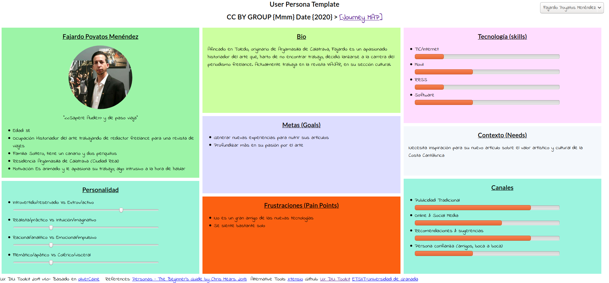

Y nuestra segunda persona, **Toph Bei Fong**, es una estudiante de cocina un poco tímida que adora el flamenco:

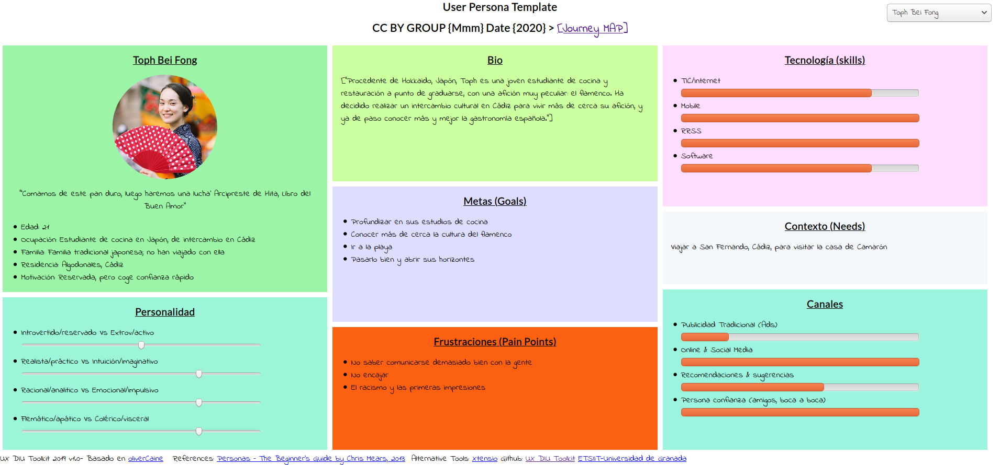

### Objetivos de los usuarios

Identificamos los objetivos de los usuarios basándonos en las dos personas que hemos creado:

+ Los usuarios quieren una aplicación fácil y rápida de usar, que además sea intuitiva, para no perder el tiempo ni frustrarse al realizar la tarea que quieren llevar a cabo.
+ Los usuarios quieren interaccionar con otros usuarios de la aplicación para poder realizar viajes juntos.
+ Los usuarios quieren ver y escribir reseñas, experiencias y opiniones de sus viajes.

### Puntos de dolor de los usuarios

También identificamos los puntos de dolor de los usuarios, basándonos también en las dos personas que hemos creado:

+ Los usuarios no quieren distraerse de su tarea principal.
+ La comunicación con los interesados en un viaje debe ser simple y eficaz.
+ Algunos usuarios necesitan ayuda adicional para usar la página.

 1.c User Journey Map
----

Es común que gente reacia a la tecnología tenga problemas sin una buena experiencia de usuario. Aun así, una buena experiencia de usuario es útil.

Fajardo quiere buscar un viaje barato al norte de España para poder inspirarse y redactar su artículo relacionado con la Costa Cantábrica:

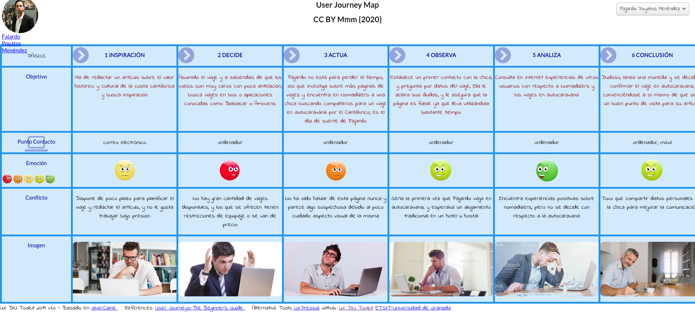

Toph quiere conocer más sobre la historia de Camarón, y busca una ruta por San Fernando:

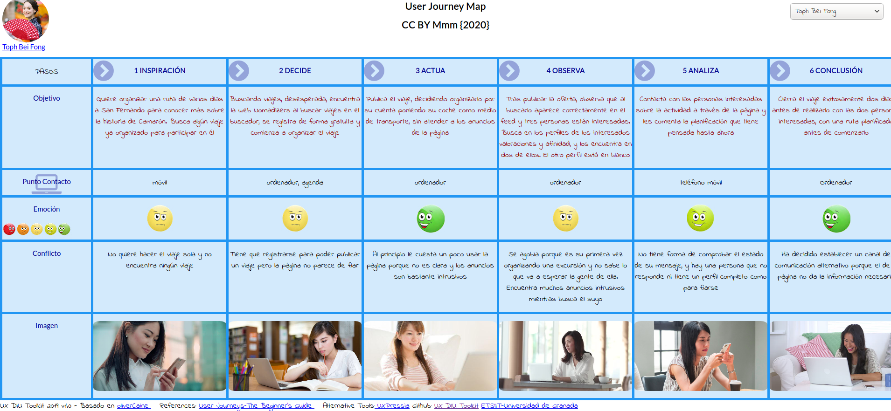

 1.d Usability Review
----
La revisión de usabilidad se encuentra en P1/usability review.xlsx

Valoración numérica: 49 puntos.

La aplicación deja mucho que desear, a cada función que probábamos encontrábamos errores. Además es poco visual y está llena de publicidad.

------

## Paso 2. UX Design  

 2.a Feedback Capture Grid
----

Como conclusión al uso de la página Nomadizers, creamos este diagrama con los aspectos más destacados:

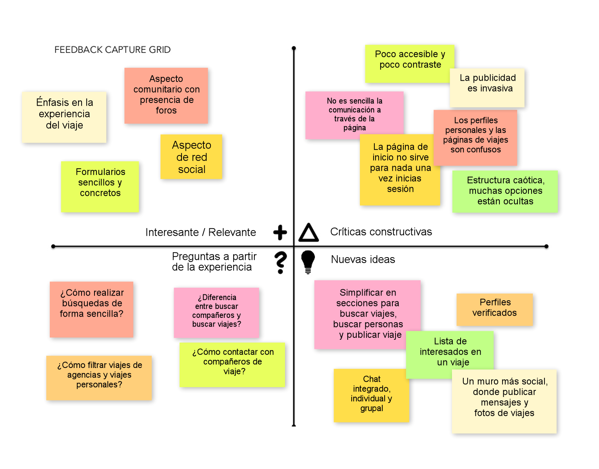

Partiendo de la página web, proponemos *simplificar en secciones* las tareas que puedes hacer en la página (viajes, personas y publicación), introducir el concepto de *usuario verificado* para poner en mejor lugar a las agencias de viajes, un *chat integrado* para mejorar la comunicación y mejorar más aún el *aspecto social* de la web con foros y mensajes.

 2.b Tasks & Sitemap 
-----

Necesitábamos distinguir entre usuarios cuya actividad principal es buscar viajes y usuarios que suelen publicar viajes (como las agencias), por lo que las tareas que se pueden realizar en la aplicación y los usuarios que pueden realizarlas son:

### Matriz de Tareas y Usuarios

|                                    | Usuario no identificado | Usuario identificado | Usuario verificado | Administrador |
| ---------------------------------- | :---------------------: | :------------------: | :----------------: | :-----------: |
| Registrarse                        |            M            |                      |                    |               |
| Identificarse                      |                         |          A           |         A          |       A       |
| Borrar usuario                     |                         |                      |                    |       B       |
| Buscar viaje                       |            M            |          A           |         A          |       A       |
| Ver viaje                          |            M            |          A           |         A          |       A       |
| Inscribirse a viaje                |                         |          M           |         M          |               |
| Publicar viaje                     |                         |          M           |         M          |               |
| Modificar viaje propio             |                         |          B           |         B          |               |
| Cancelar viaje propio              |                         |          B           |         B          |               |
| Cancelar viaje ajeno               |                         |                      |                    |       B       |
| Promocionar viajes propios         |                         |                      |         A          |               |
| Ver estadísticas de viajes propios |                         |                      |         A          |               |
| Ver perfil                         |            M            |          M           |         M          |       A       |
| Modificar perfil propio            |                         |          B           |         B          |               |
| Utilizar mensajería                |                         |          A           |         A          |               |
| Publicar mensaje                   |                         |          A           |         A          |               |
| Eliminar mensaje propio            |                         |          B           |         B          |               |
| Eliminar mensajes ajeno            |                         |                      |                    |       B       |
| Participar en foros                |                         |          A           |         A          |               |
| Moderar foros                      |                         |                      |                    |       M       |

Por tanto, tenemos cuatro tipos de usuario en la aplicación:

+ Un **usuario sin identificar** que entra a la aplicación para ver viajes.
+ Un **usuario identificado** que suele buscar viajes, publica alguno de vez en cuando y participa en foros.
+ Un **usuario verificado** que se dedica a publicar viajes y promocionarlos.
+ El **administrador** de la aplicación, encargado de moderar la aplicación.

### Sitemap

Con todas estas posibles acciones que puede hacer el usuario, diseñamos el concepto de la aplicación y sus páginas:

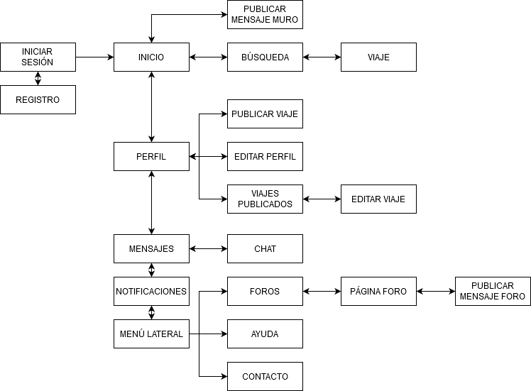

 2.c Labelling 
----

### Etiquetado

Este es el significado de cada término utilizado en el sitemap:

| Término                                   | Significado                                                  |
| ----------------------------------------- | ------------------------------------------------------------ |
| Inicio                                    | Página inicial y central de la aplicación; muestra el *muro* |
| Iniciar sesión                            | Introducir datos de usuario para entrar en la aplicación     |
| Registro                                  | Formulario para el ingreso de un nuevo usuario               |
| Muro                                      | Conjunto de mensajes que escriben los usuarios               |
| Publicar mensaje                          | Formulario para escribir un nuevo mensaje en el muro         |
| Búsqueda                                  | Búsqueda del contenido de la aplicación (viajes y perfiles)  |
| Resultados                                | Resultados de la búsqueda de contenido (viajes y perfiles)   |
| Foros                                     | Conjunto de mensajes sobre temas de interés                  |
| Página del foro                           | Mensajes, dudas y opiniones de los usuarios sobre el tema de interés |
| Publicar mensaje en el foro               | Formulario para escribir un nuevo mensaje en el foro         |
| Perfil                                    | Información de un usuario                                    |
| Editar perfil                             | Edición de la información de un usuario                      |
| Mensajes                                  | Conjunto de conversaciones en las que participa un usuario   |
| Chat                                      | Conversación en la que participa un usuario                  |
| Notificaciones del muro y de foros        | Avisos sobre nuevos mensajes                                 |
| Viaje                                     | Página descriptiva de un viaje publicado                     |
|        | Icono relacionado con la página *Inicio*                     |
|      | Icono relacionado con la página *Búsqueda* y la acción de buscar resultados |
|        | Icono relacionado con la página *Perfil*                     |
|        | Icono relacionado con la página *Mensajes*                   |
|        | Icono relacionado con la publicación de mensajes, tanto en el *muro* como en el *foro* |
|        | Icono relacionado con la publicación de un nuevo *viaje*     |
|        | Icono relacionado con la *edición* de una página, ya sea el *perfil* o un *viaje* |
|  | Icono relacionado con la inscripción a un *viaje*            |
|       | Icono relacionado con el *envío* de un mensaje               |

 2.d Wireframes
-----

### Bocetos Lo-Fi

Estas son las distintas pantallas de la interfaz de la aplicación.

| Inicio                             | Búsqueda                          | Notificaciones                     |
| ---------------------------------- | --------------------------------- | ---------------------------------- |
|            | 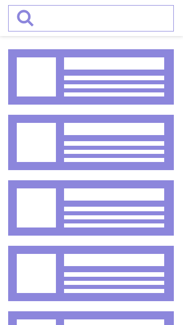      | 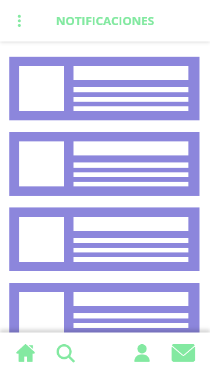 |
| **Perfil**                         | **Mensajes**                      | **Viaje**                          |
| 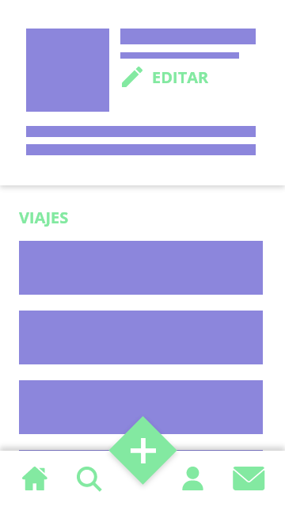         | 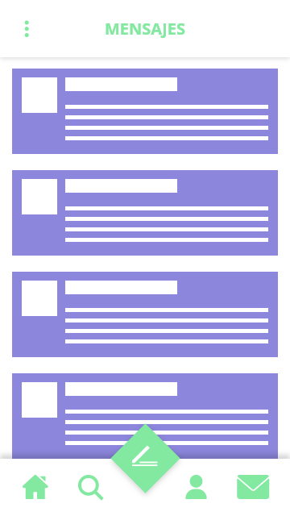      | 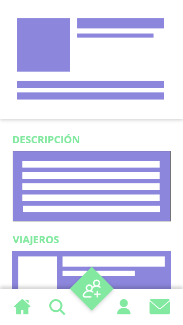          |
| **Foros**                          | **Página foro**                   | **Publicar mensaje foro**          |
| 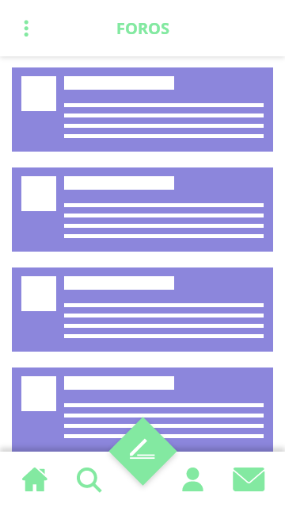          |    |   |
| **Publicar mensaje muro**          | **Editar perfil**                 | **Editar viaje:**                  |
|        | 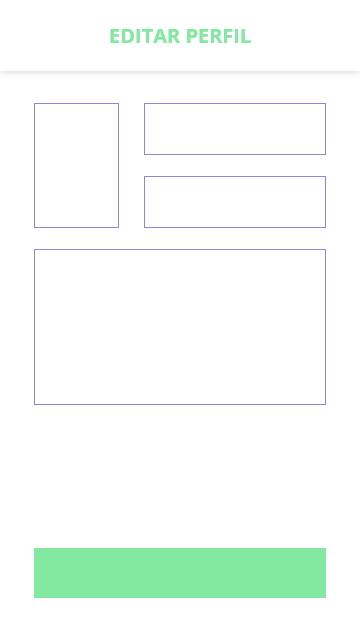 | 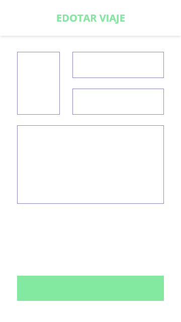   |
| **Ayuda**                          | **Chat**                          | **Contacto**                       |
| 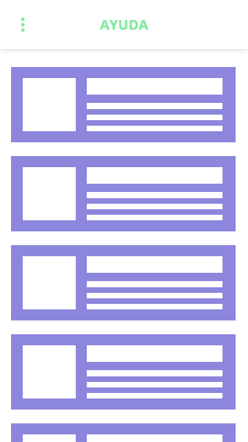          | 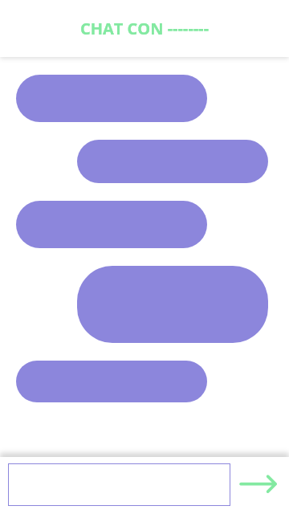          | 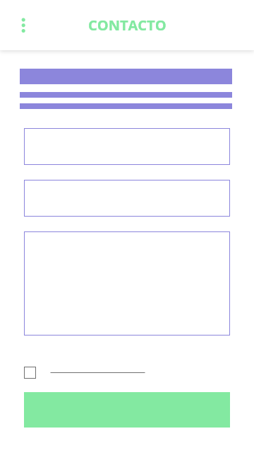       |
| **Iniciar sesión**                 | **Registro**                      | **Menú lateral**                   |
|  | 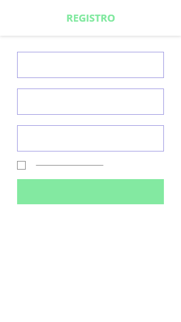      |    |

****

## Paso 3. Mi equipo UX-Case Study 

 3.a ¿Como se cuenta un UX-Case Study?
-----

Tras leer y analizar el UX Case Study de MuseMap, hemos visto una serie de procedimientos y  técnicas que pueden ser utilizadas para lograr encontrar la finalidad y los detalles de una aplicación a través del diseño, y transmitirlos al equipo de desarrollo, al usuario final o a los clientes y *stakeholders*. 

Para más desarrollo, ir [aquí](P3).

  3.b Logotipo
----

### Logotipo

Para actualizar la imagen de la aplicación a las nuevas líneas de diseño, expuestas con más detalle en el punto **Guía de Estilo**, se ha optado por un diseño más sobrio a la vez que colorido. Esto a su vez ayuda a identificar la marca en formatos más pequeños, como las pantallas de dispositivos móviles o el icono identificativo de la app.

Podemos observar el logo antiguo aquí:

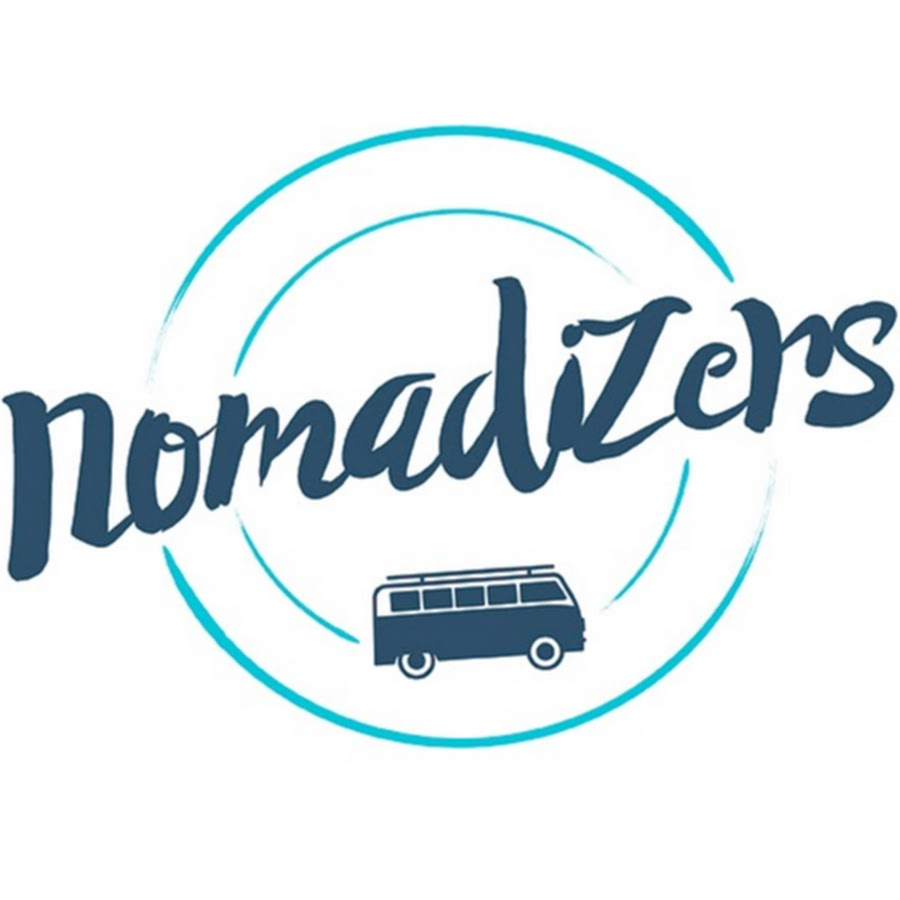

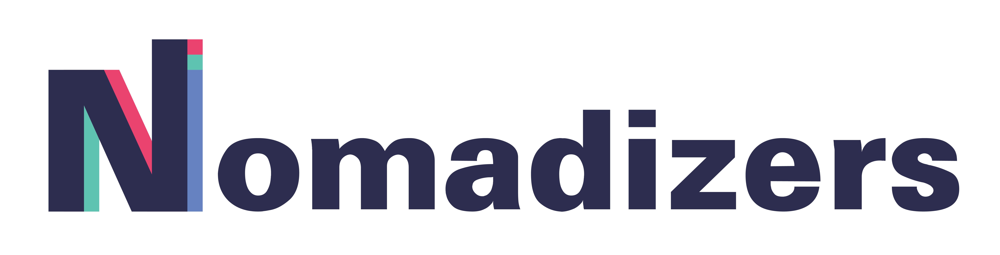

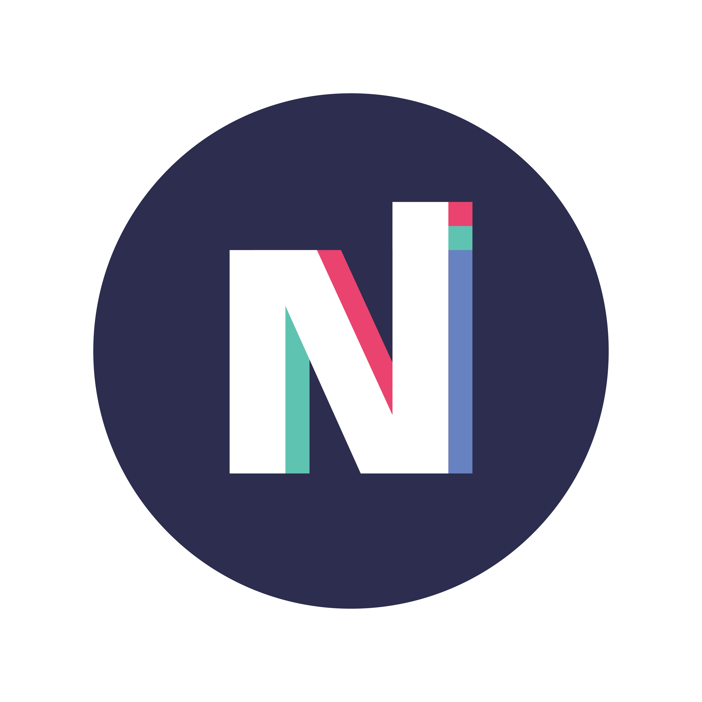

### Guía de estilo

La nueva imagen corporativa que proponemos para Nomadizers ha sido elaborada utilizando Adobe Illustrator CC. 

Se utiliza la tipografía Univers debido a sus formas legibles y modernas. Para los iconos, se ha decidido representar los distintos elementos clave de la aplicación con formas geométricas, utilizando los diferentes colores corporativos. 

Para la paleta de colores, se han escogido tonalidades poco saturadas de rojo, azul y verde, en contraste con blanco puro y una tonalidad de azul muy oscura.

 3.c Guidelines
----

#### Propuesta de elementos de diseño o patrones a usar 

Se ha investigado acerca del sistema de diseño Material Design, descrito en [material.io](material.io), para su posible implementación en la app *Nomadizers*.

Se trata de un lenguaje de diseño que destaca por su estudio de los materiales, cómo interactúan entre ellos y cómo comparten un espacio físico y pueden ser apilados, proyectar sombras y presentar profundidad.

El lenguaje Material Design es fácil de implementar, y presenta mucha flexibilidad. Además, es idóneo para aplicaciones móviles y web, y pemite expresar la nueva imagen de marca con mayor personalidad, integrándola en el diseño.

Una de las principales características de Material Design es cómo todos los elementos de la interfaz de usuario son definidos como **sólidos**. Algunas de sus propiedades son las siguientes:

- No puede haber dos elementos al mismo nivel ocupando el mismo espacio.
- Los elementos pueden **apilarse** y colocarse en diferentes capas.
- La interacción del usuario con un elemento no lo atraviesa.
- Los elementos pueden dividirse y recombinarse.
- Los elementos pueden cambiar su forma.
- Los elementos pueden cambiar de opacidad, ya sea uniformemente o de forma parcial.
- Los elementos pueden ampliarse y reducirse únicamente en el plano en el que están contenidos, nunca doblarse o extruirse en profundidad.
- Los elementos pueden moverse de forma tridimensional. Esto suele ser el resultado de entrada de usuario.
- Todas las superficies tienen como profundidad fija 1dp.

  3.d Video
----

El vídeo que resume el diseño de nuestro producto está en este [enlace](https://youtu.be/dOXv44cuGog).

------

## Paso 4. Evaluación 

 4.a Casos asignados
----

#### Caso 1

<u>Nombre del equipo</u>:  **DIU1.ODAKACI** ([web](https://github.com/cmartin-moreno/DIU20))

<u>Descripción</u>: aplicación de citas y viajes **Miss Travel**, en la que una persona propone el viaje y se ofrece a pagarlo a la otra persona. Según el equipo, han elegido la aplicación debido a que mezcla dos temáticas diferentes.

#### Caso 2

<u>Nombre del equipo</u>:  **DIU2.Ortega-Y-Gasset** ([web](https://github.com/romanlarrosa/DIU20))

<u>Descripción</u>: aplicación de compartir piso Sharee, que parte de las funcionalidades de Badi y pretende mejorar la experiencia de compartir alojamiento.

#### Caso 3

<u>Nombre del equipo</u>:  **DIU3.Manduka** ([web](https://github.com/alexhzr/diumanduka))

<u>Descripción</u>: aplicación para compartir cenas o cursos de comida Comecon. Se hace mucho hincapié en que es similar a un "Air-BnB de comida".

Para más información sobre los casos, ir a la carpeta de la práctica 4: [link](P4).

 4.b User Testing
----

A continuación se describe la experiencia de nuestra persona ***Fajardo Poyatos Menéndez*** en cada uno de los casos anteriores:

#### En el caso 1:

Fajardo necesita un nuevo enfoque para uno de sus artículos, y buscando en internet se ha topado con la aplicación Miss Travel. La propuesta le ha parecido interesante, y ha pensado que compartir un viaje de forma más personal podría ser interesante. 

Fajardo se registra en la página web, que le resulta más familiar que una aplicación móvil dado su limitado uso de la tecnología, y ve una estructura clara en la web para navegar. Le cuesta encontrar el formualrio de buscar viaje, y finalmente se da por vencido, buscando alternativas para su nuevo artículo.

#### En el caso 2:

Fajardo va a realizar un reportaje sobre la provenza, concretamente Marsella y su arte urbano. Para profundizar más, ha decidido buscar alojamiento en la ciudad, y dado que los hoteles suponen una opción más cara, decide utilizar una app. Descubre Sharee, y decide registrarse desde la web. 

Accede al buscador, e introduce Marsella. Aparecen varios resultados, y se fija en el primero de ellos. Le gusta el piso, pero quiere buscar algo más barato, así que guarda la consulta en favoritos para poder consultarlo luego si es necesario. 

#### En el caso 3:

Fajardo quiere añadir un toque gastronómico a su artículo sobre Marsella, ya que le ha parecido una parte importante de su experiencia allí, y le gustaría cenar con lugareños para degustar la comida casera de la zona. Su compañero de piso le ha recomendado la aplicación *comecon*,  ya que la ha utilizado alguna vez, y procede a acceder desde la web, el medio al que está más acostumbrado.

Al entrar, decide registrarse, y es gratamente sorprendido por un tour que le guía por la aplicación. Además, la aplicación le consulta si reside actualmente en Marsella, a lo que Fajardo responde de forma afirmativa. Sigue paso a paso el tour y consigue contactar con una familia joven a pocas calles de su piso para cenar en un par de noches. 

4.c Ranking 
----

### Ranking

**1º** puesto con **90** puntos: **Sharee**, de DIU2.Ortega-Y-Gasset ([web](https://github.com/romanlarrosa/DIU20)).

**2º** puesto con **82** puntos: **Miss Travel**, de DIU1.ODAKACI ([web](https://github.com/cmartin-moreno/DIU20)).

**3º** puesto con **70** puntos: **Comecon**, de DIU3.Manduka ([web](https://github.com/alexhzr/diumanduka)).

### Valoración personal

En general, los tres casos que hemos tenido que revisar han realizado todos los ítems de las prácticas, pero solo en el caso 2 está todo el proceso del producto bien documentado en los distintos *readme*. 

La historia del producto es muy importante para saber cómo se ha desarrollado el proyecto, y ayuda a identificar rápido los problemas que puede haber a la hora de que los usuarios usen la aplicación.

## Conclusión final / Valoración de las prácticas

En conclusión, el proceso de desarrollo de diseño siguiendo la metodología UX sirve de mucha ayuda para describir cómo el producto ha ido tomando forma, registrar todos los cambios de diseño y sacar conclusiones de qué puede mejorar el producto en cada paso.